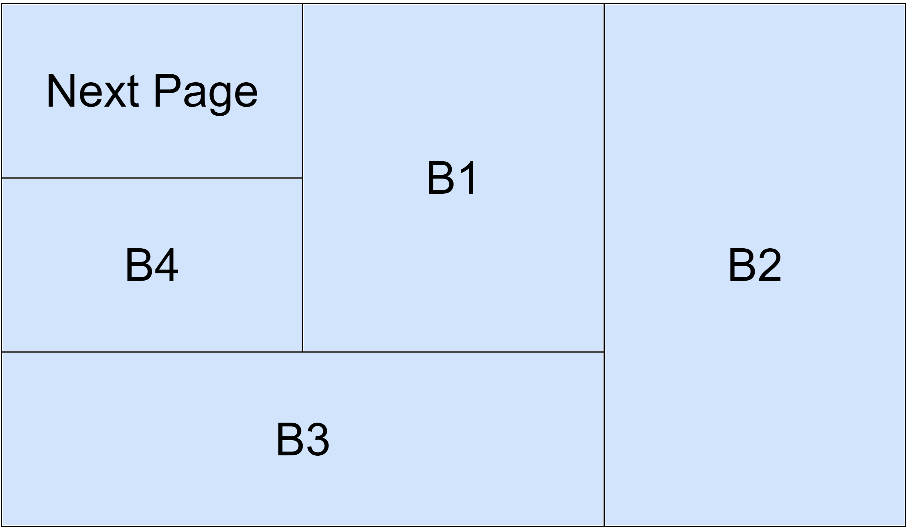
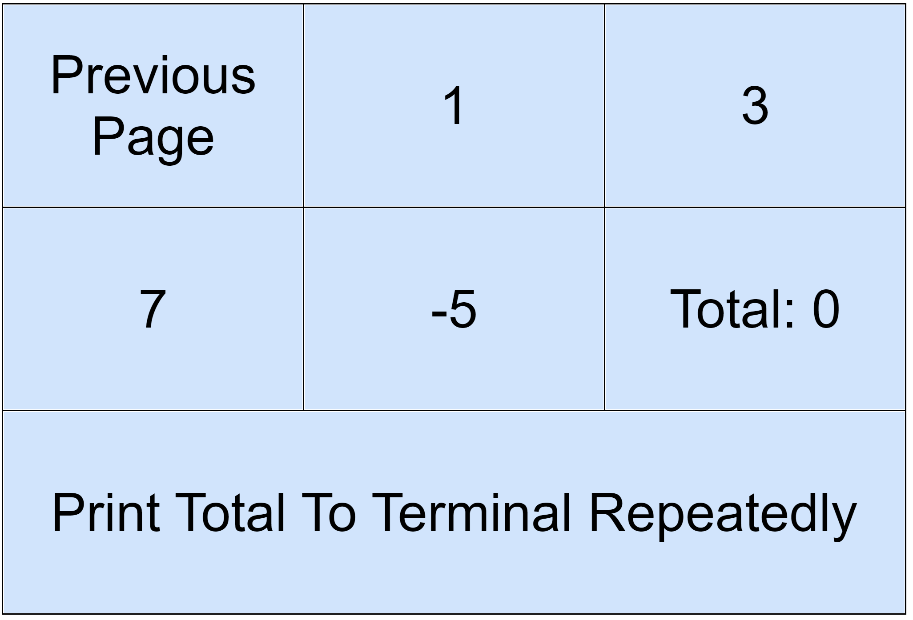
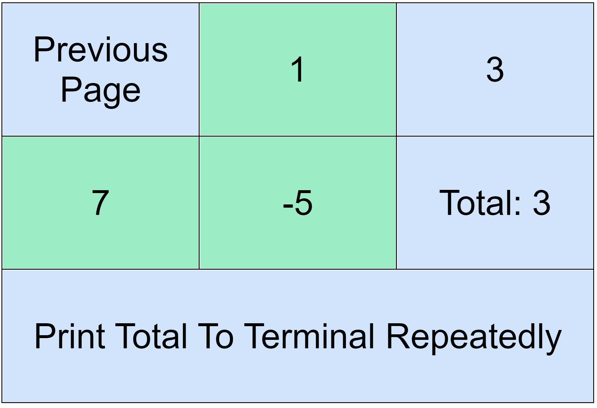

## RemoteHotkey Example

This example demonstrates the use of RemoteHotkey, which can be found here: https://github.com/gwubc/RemoteHotkey

### Getting Started
Start the server by running `python ClientExample.py`.\
Access the server interface at http://localhost:5000/.

### Interface Overview
##### Initial Page: 

The first page appears as shown in the image below:

Clicking on buttons [B1, B2, B3, B4] will output "B_ clicked" to the terminal.

##### Navigation: 
Select "Next Page" to navigate to the next screen:

Clicking on numbers changes the total. For example, clicking 1, 7, -5 results in the updated total shown here:

The total is automatically updated after each click.

###### Additional Feature: 
By clicking "Print Total To Terminal Repeatedly", the current total will be printed to the terminal every second.

### Customization
UI Customization: Modify the user interface by editing `CustomTemplate.py`.\
Behavior Customization: Change the functionality of each button by editing `CustomTemplate.py` and `MainActionManager.py`.